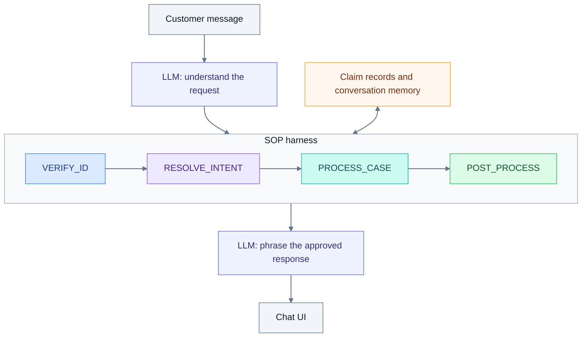

# Insurance Claims SOP Agent

An insurance support demo with natural conversation and a code-controlled workflow. The LLM interprets messages and writes replies; the harness controls identity verification, case access, and email consent. Useful case hints are remembered across phases.

**[Open the demo](https://insurance-claims-sop-agent-d5gs.onrender.com)** — no API key required. The owner funds model usage. The free service may need about a minute to wake.

Built with React, TypeScript, FastAPI, Pydantic, and SQLite. Local Docker and the hosted demo use the same application. Customer data is synthetic; email delivery and human transfers are simulated.

## Workflow



Claim details require at least three matching identity categories. The agent can clarify, acknowledge frustration, and offer alternatives without skipping required steps.

## Local setup

Install Git and Docker Desktop, then start Docker. You need an OpenAI-compatible or Anthropic API key and internet access for model requests.

### 1. Download and configure

```bash
git clone --branch feat/hosted-demo https://github.com/XinhaoTheo/insurance-claims-sop-agent.git
cd insurance-claims-sop-agent
cp .env.example .env
```

Edit `.env`:

```dotenv
MODEL_API_PROTOCOL=openai
MODEL_API_KEY=your-api-key
MODEL_NAME=your-model-id
MODEL_BASE_URL=
```

Use `anthropic` for Claude. Leave the base URL blank for the selected protocol's official endpoint, or enter a compatible API root, usually ending in `/v1`. Use a model ID available to your account. Never commit your key.

### 2. Start the app

```bash
docker compose up --build -d
```

Open **[localhost:8000](http://localhost:8000)**. Docker builds the UI and backend and creates SQLite automatically; no separate database setup is needed.

Alternatively, start without model defaults and open **Model settings** in the UI. Enter the protocol, base URL, model, and key, then click **Test connection → Apply model**. These settings apply to the current conversation; temporary keys expire after one hour or a server restart.

After editing `.env`, run `docker compose up -d`, reload the page, and start a new conversation.

### 3. Try a conversation

```text
I'm the policyholder. My name is Margaret Chen, policy POL-9921.
I'm calling about my denied healthcare claim from January.
DOB is 1985-03-15, SSN last four is 4472.
```

Then ask **“What documents do I need?”**, followed by **“That's all, please summarize.”** Choose **Send mock email** or **Skip email**.

The app uses today's date. To demonstrate the sample before its appeal deadline, set `DEMO_DATE=2026-03-10` before starting a new conversation.

### Logs and shutdown

```bash
docker compose logs -f app
docker compose down
```

Local conversations survive normal restarts in a Docker volume. Render Free uses temporary storage, so conversations may be lost after sleep, restart, or redeployment.

## More details

- [Architecture](docs/architecture.md): modules, identity handling, and SOP gates.
- [Hosting](docs/hosting.md): deploy the same app on Render.
- [Testing](docs/testing.md): automated tests and real-model evaluation.
- [Evaluation results](docs/evaluation-results.md): latest cloud results and known limits.
- [Local API reference](http://localhost:8000/docs): endpoints for automated clients.
