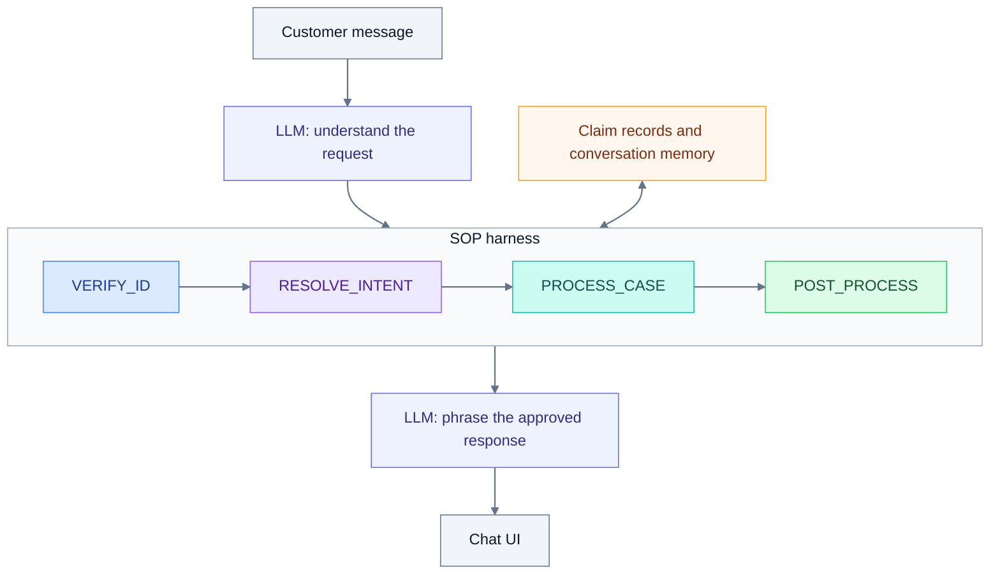

# Insurance Claims SOP Agent

A chat demo for an insurance claims support agent, using the same code for local Docker and hosted URLs. An LLM understands the customer and phrases replies naturally, while a code-controlled SOP handles identity verification, case selection, claim support, and optional email follow-up.

The agent requires three matching identity fields before accessing claim details and remembers useful information across workflow stages. The UI shows the conversation, current phase, saved case hints, and activity log. Customer records are synthetic; email delivery and human handoff are simulated.

**[Open the hosted demo](https://insurance-claims-sop-agent-d5gs.onrender.com)** · No API key needed for the hosted demo. The free service may take about a minute to wake.

<!-- Add a demo screenshot here when available. -->

## Overall workflow



The harness advances only when each stage's requirements are met. A conversation can stay in one stage for several turns or complete multiple stages in one turn.

## Setup

You need **Git**, **Docker Desktop** running (or Docker Engine with Compose), and your own **OpenAI-compatible or Anthropic API key**. Model requests require an internet connection and use your provider account.

### 1. Start the app

```bash
git clone --branch feat/hosted-demo https://github.com/XinhaoTheo/insurance-claims-sop-agent.git
cd insurance-claims-sop-agent
docker compose up --build -d
```

The first build downloads dependencies and may take a few minutes. Docker includes the frontend, backend, test data, and SQLite database; no separate Python, Node.js, or database setup is needed.

Open **[http://localhost:8000](http://localhost:8000)**. The page opens without an API key; connect a model before chatting.

### 2. Connect your model

Open **Model settings** and fill in:

| Setting | What to enter |
| --- | --- |
| API protocol | **OpenAI-compatible** or **Anthropic (Claude)** |
| API base URL | The official address is filled automatically. Change it if using another compatible service. Use the API root, usually ending in `/v1`. |
| Model name | The exact model ID available to your account |
| API key | Your provider's API key |

Click **Test connection**, then **Apply model**. Testing the connection alone does not apply the settings.

Settings entered here apply to the current conversation. Session keys are kept in backend memory, not the database or browser storage, and expire after one hour. Reconnect after a server restart, or configure defaults below for new conversations.

### 3. Try the workflow

Paste this synthetic customer example into the chat:

```text
I'm the policyholder. My name is Margaret Chen, policy POL-9921.
I'm calling about my denied healthcare claim from January.
DOB is 1985-03-15, SSN last four is 4472.
```

The agent should verify the three identity fields, reuse the claim hint, and explain the matching claim. Ask a follow-up such as **"What documents do I need?"**, then say **"That's all, please summarize."** Choose **Send mock email** or **Skip email** to finish.

The demo uses today's date by default, so a recorded appeal deadline may already have passed. To demonstrate the supplied case before its deadline, set `DEMO_DATE=2026-03-10` in `.env` before starting a new conversation.

### Optional: configure defaults with `.env`

For repeated sessions or automated testing, configure the model before starting the app:

```bash
cp .env.example .env
```

Edit `.env`:

```dotenv
MODEL_API_PROTOCOL=openai
MODEL_API_KEY=your-api-key
MODEL_NAME=your-model-id
MODEL_BASE_URL=
```

Use `anthropic` for Claude. A blank `MODEL_BASE_URL` selects the protocol's official endpoint. Keep your real key out of Git.

After changing `.env`, run `docker compose up -d`, reload the page, and start a **New conversation** to use the updated defaults.

### Stop or troubleshoot

```bash
# View startup errors or request logs.
docker compose logs -f app

# Stop the app and retain its database.
docker compose down
```

SQLite data is stored automatically in a Docker volume and survives normal restarts.

## Public URL

The first public deployment targets **Render Free**, using the included `render.yaml`. It sleeps after 15 idle minutes and resets saved conversations when it restarts. See [Hosting](docs/hosting.md) for setup and optional paid hosting with persistent SQLite. This hosted demo uses an operator-funded model: visitors can chat immediately, and model settings are managed on the server. Local Docker keeps configurable endpoints and your own API credentials.

For automated evaluation, open the [local API documentation](http://localhost:8000/docs). See [Architecture](docs/architecture.md) for implementation details.

See [Testing](docs/testing.md) to run the real-model acceptance scenarios and measure response latency.
