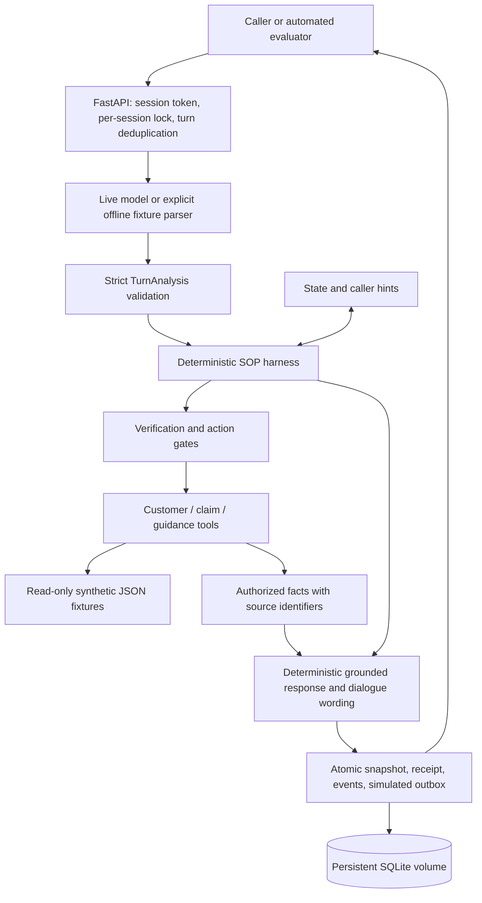
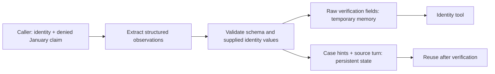
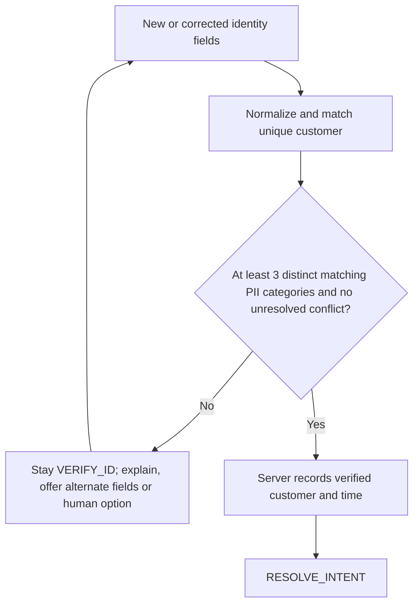
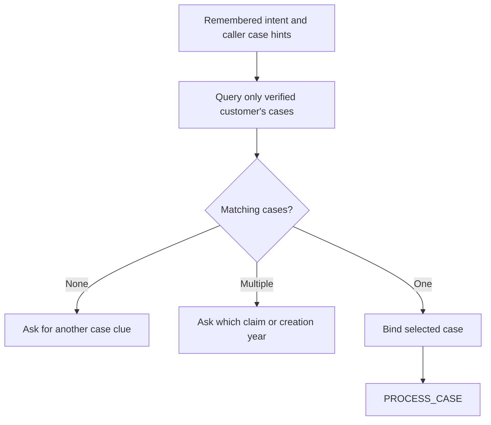
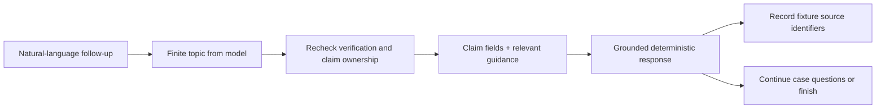
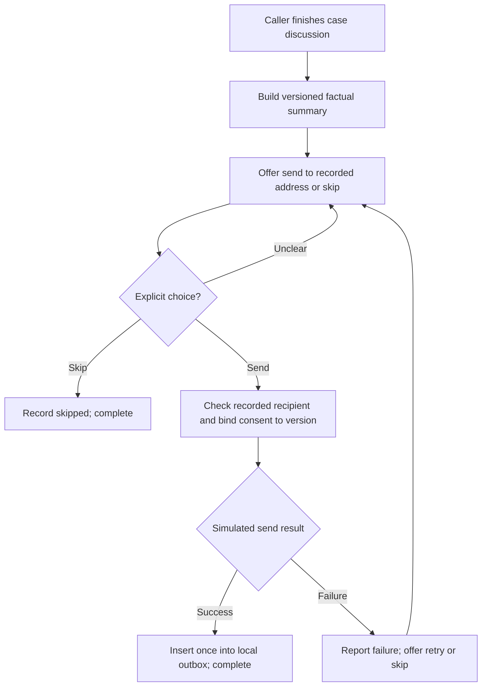
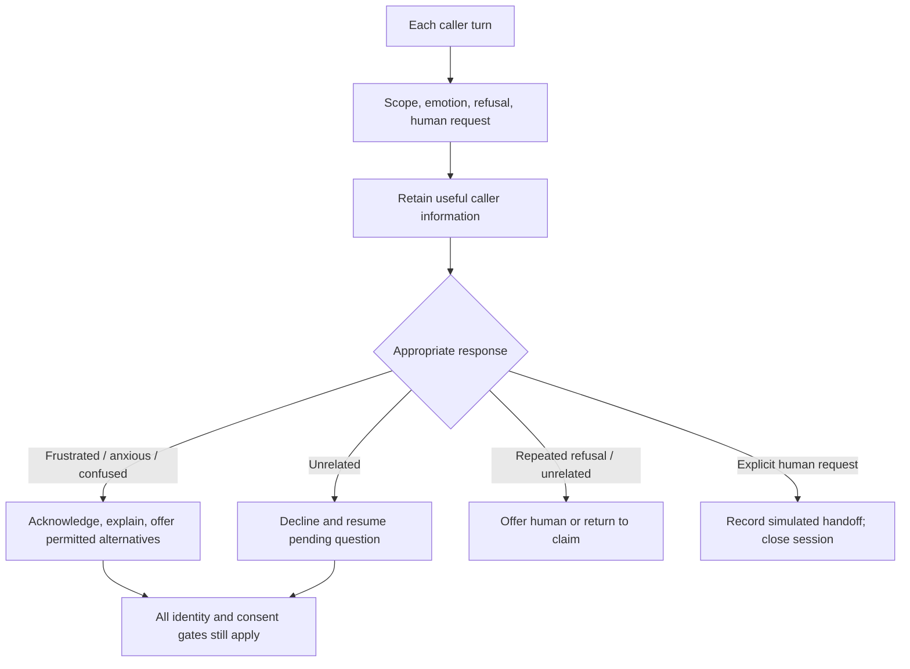
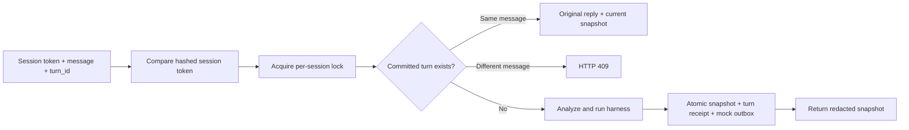
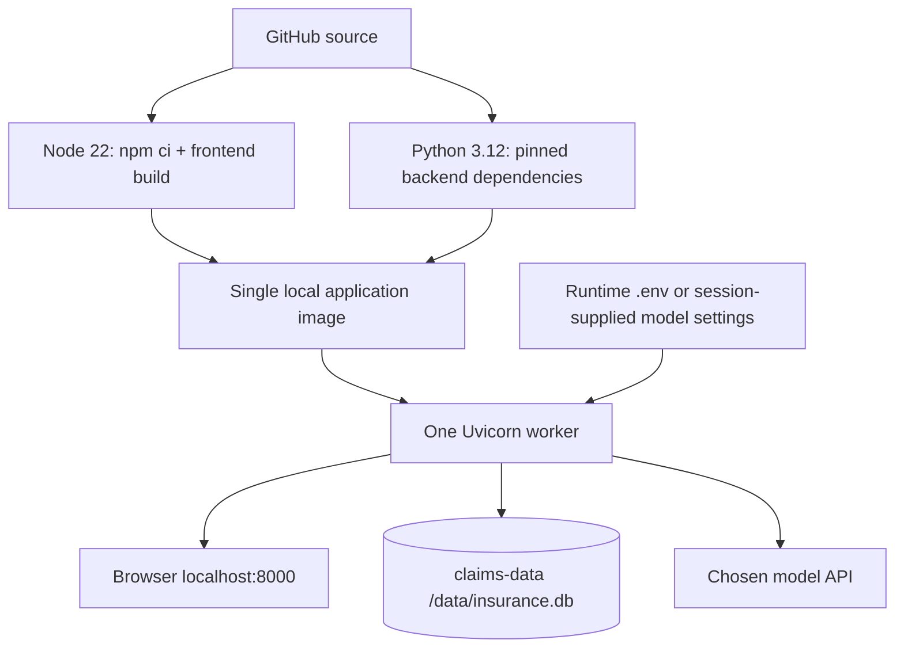

# Architecture and SOP mechanics

This implementation is a local, single-process application. The browser is a client of the same HTTP API used by automated evaluators. The model produces untrusted observations; deterministic code controls business state and protected actions.

## Overall request path

A successful turn can pass through several stages internally, but only in the prescribed order. Queries are not executed speculatively before identity verification.

## 1. Language understanding and cross-phase memory

`backend/app/llm.py` calls an OpenAI-compatible Chat Completions endpoint in live mode. The prompt and Pydantic schema permit only finite intent/topic/choice values, identity observations and case hints. There are no model-writable fields for `verified`, `phase`, or tool authority. Unknown fields are rejected. Malformed JSON gets at most one correction attempt; request failures and unresolved validation errors leave business state unadvanced.

The model receives the newest caller message plus a whitelisted context: phase, pending task, hints, intent, language, collected identity field names and a short previous assistant reply. It does not receive the entire customer or claims database. Caller assertions about a case remain distinct from facts retrieved from the fixture repository.

Offline mode uses deterministic patterns for the fixture examples and common English/Chinese phrases. It makes no model request and is useful for repeatable policy tests, not proof of broad natural-language coverage.

## 2. VERIFY_ID: deterministic identity gate

`FixtureRepository.verify_identity` normalizes permitted fields, resolves the same unique customer and requires at least three distinct matching categories: full name, DOB, phone, email or SSN last four. A policy number helps locate the customer but does not count toward that threshold. Registered aliases stay within their original category. Non-SSN identity types are not silently treated as SSNs.

The harness checks that extracted identity values were actually supplied in the caller's current message, allowing simple normalization. Supplied conflicting fields cannot be ignored just because three other values happen to match. Identity corrections and expired verification revoke access. The protected tools also check verification and ownership at their own entry points.

Parsed raw identity values are temporary, with a one-hour inactivity expiry; the persisted transcript redacts recognized values. Verification in active sessions expires one hour after it was established. Completed sessions remain closed. These demo rules are not a substitute for a real insurer's identity-assurance process.

## 3. RESOLVE_INTENT: use remembered hints to find the case

The model interprets a caller's wording into bounded intents and case hints. The repository performs the actual filtering, scoped to the verified customer. No candidates triggers clarification; multiple candidates trigger a distinguishing question; one consistent candidate binds the selected case.

The January/healthcare/denied sample selects `CL-2048` without asking for the caller's purpose again. A January healthcare query without a status/year can be ambiguous. Creation dates are the only dates in these fixtures; service dates require clarification rather than an invented equivalence.

## 4. PROCESS_CASE: bounded topics and grounded facts

The live model chooses among topics such as denial, documents, alternative documents, submission method, processing time, deadline, payment, receipt and format. The repository supplies approved fixture guidance and the authorized claim record. The harness renders business facts deterministically. Empathy, clarification and recovery are selected from bounded dialogue wording; this version does not let the model rewrite arbitrary business facts.

Unknown topics get an explicit limitation and a human-service option. A maximum allowable amount is not presented as guaranteed reimbursement. The business date is explicit: past appeal deadlines are reported as expired and generic guidance does not override the case-specific deadline. No appeal, upload, payment or claim decision is actually changed by this demo.

## 5. POST_PROCESS: versioned summary and explicit choice

A caller indicating the case discussion is done causes the harness to prepare a summary. It includes discussed topics, the recorded claim status, the outcome of this conversation and next steps. The outcome is informational support; it does not imply the insurance claim was resolved in the customer's favor.

Providing an email address alone is not consent. The complete message must express an immediate affirmative choice; conditional, delayed, or unrecognized wording gets a clarification. A different recipient needs a separate process and is not accepted by this demo. The summary shown in the UI masks the address. New substantive discussion updates the draft/version before a further send choice. `SIMULATE_EMAIL_FAILURE=true` exercises the failure path. There is no SMTP or external mail integration.

## 6. Scope, emotions and recovery

These checks apply in every phase. A mixed message can both contribute useful fields and contain an unrelated question: useful information is retained while the irrelevant question is declined. Three consecutive out-of-scope turns offer simulated human support. Refusals during verification similarly offer alternatives, then stop repeated persuasion and offer human support. Returning to in-scope conversation resumes the pending workflow.

Representative relationships are deliberately insufficient for authorization. The supplied representative and consent-scenario fixtures are not wired into a complete delegated-access flow; callers using that path are offered human support without receiving protected details.

## 7. Storage, credentials and idempotency

SQLite uses three tables: `sessions` for token hashes and snapshots, `turns` for message hashes and committed responses, and `email_outbox` for versioned simulated sends. A per-session async lock serializes messages within the single backend process. Snapshot, receipt and outbox writes share a transaction. The same `turn_id` and message returns the original reply with the current snapshot, without repeating actions; a changed message with the same ID is rejected.

Model keys supplied by users and parsed identity values stay in process memory; recognized PII is redacted before transcript persistence. This is bounded redaction, not a guarantee for every possible sensitive statement. Session model keys expire after one hour, completion, handoff, explicit clearing or restart. Server-default keys remain in deployment configuration. Do not run multiple workers without replacing in-memory coordination and secret storage with a deliberately shared design.

## 8. Deployment and evaluation

The Dockerfile first builds React with Node 22, then copies the output into a Python 3.12 application image. FastAPI serves the page and API together. The application runs as a non-root user; Compose exposes port 8000 on the host loopback address and mounts a named `/data` volume for SQLite. API keys are runtime values and excluded from the build context.

`scripts/smoke_test.py` exercises the actual HTTP contract with no third-party dependencies or model credentials. Backend tests cover rule enforcement and mocked model calls; live language evaluation is separate and requires an API token. Run the same smoke client against the built container to check its full HTTP path.

Public hosting is deferred. The current localhost/session-token design should not be described as a hardened multi-user cloud deployment.
