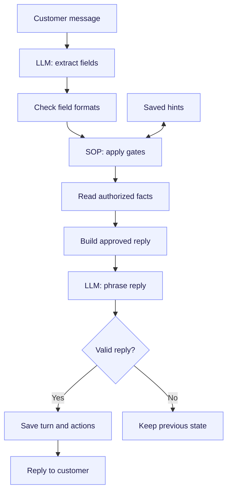
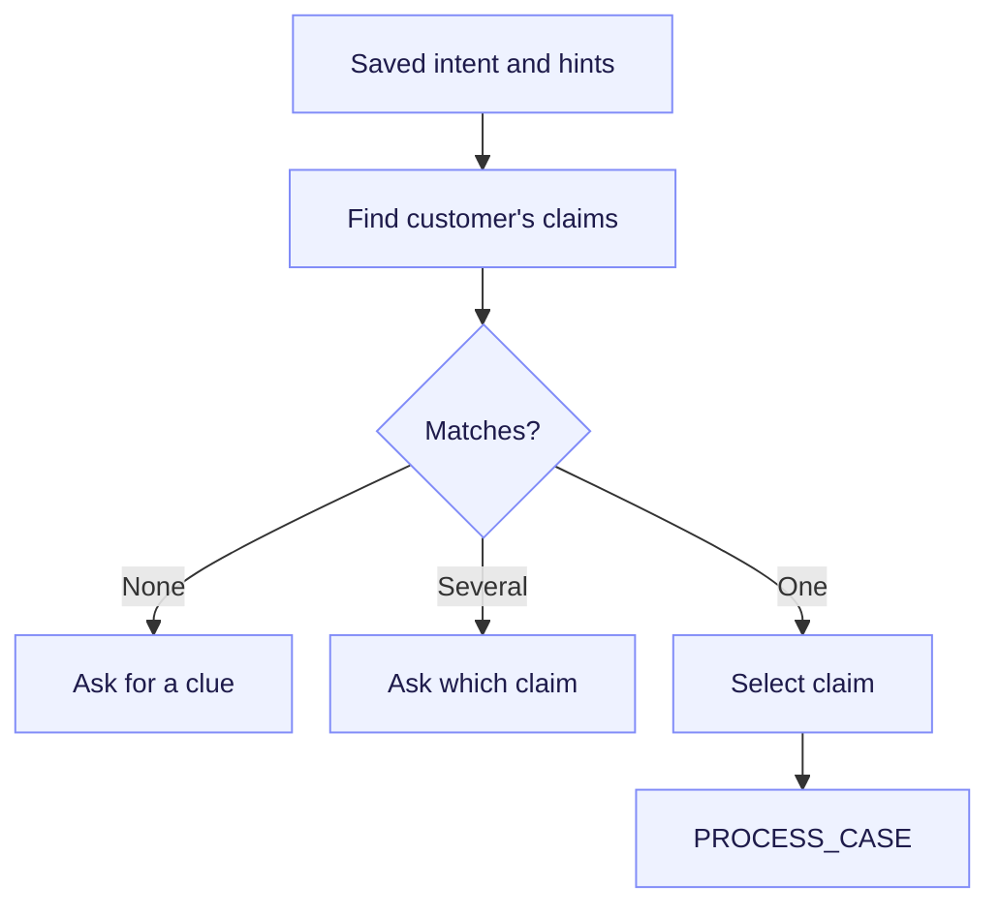
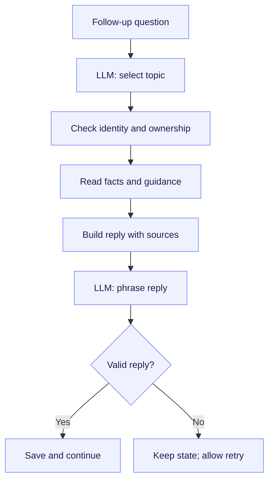
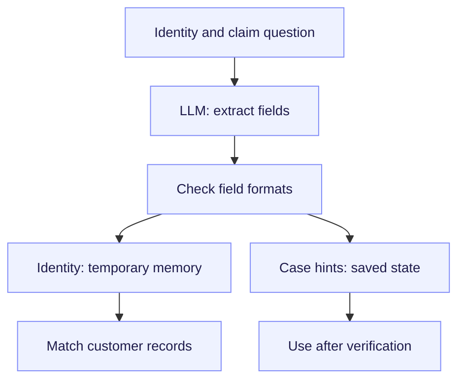
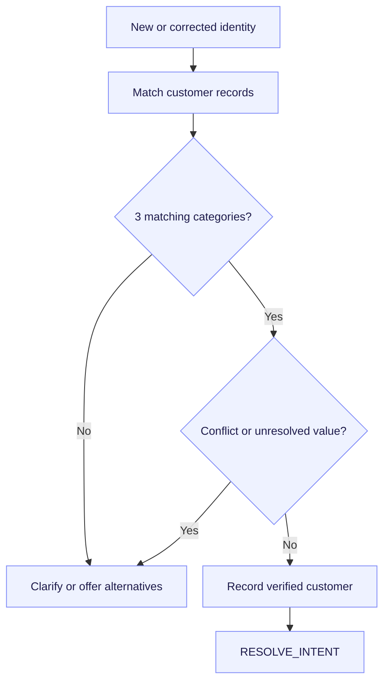
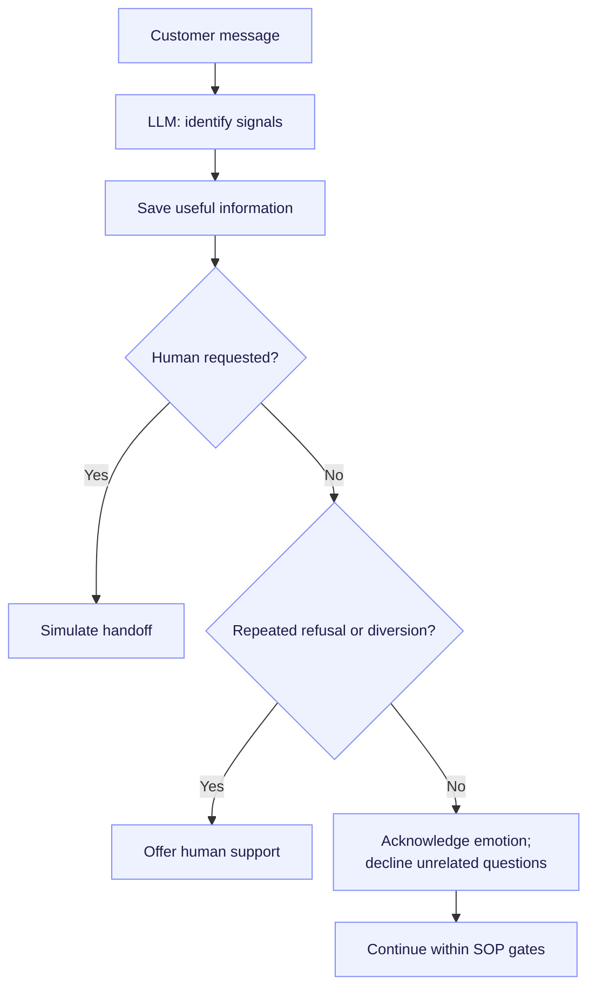
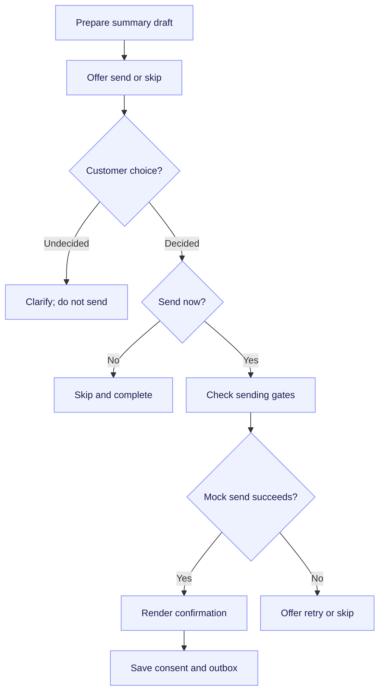
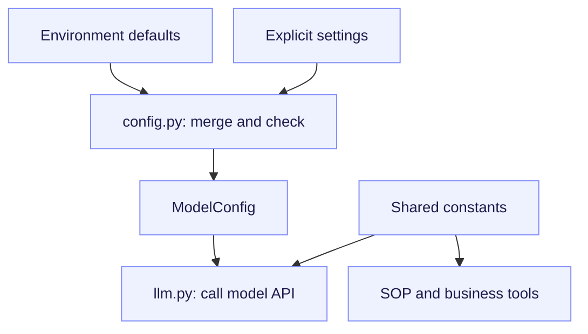
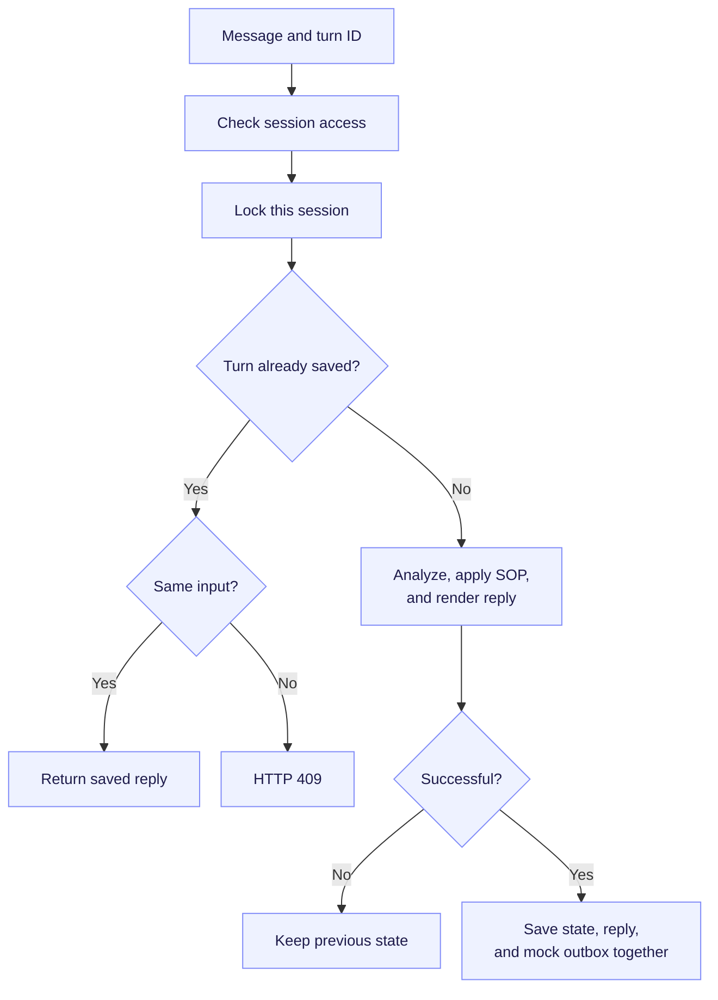
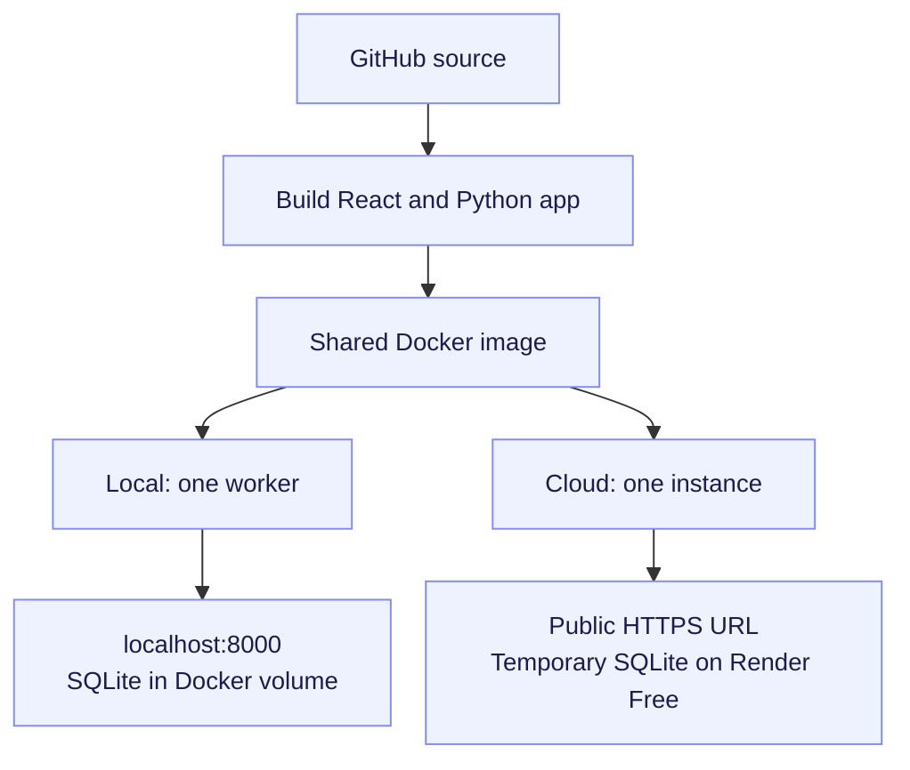

# Architecture

Each normal active-session turn follows **model analysis → schema validation → SOP rules → model rendering → commit**. The LLM interprets language; server code controls verification, phases, case access, and actions. There is no offline parser or English/Chinese business branch.

See the [overall workflow](../README.md#workflow).

## Modules

| File | Responsibility |
| --- | --- |
| `frontend/src/` | Chat, model settings, workflow state, and activity log. |
| `backend/app/main.py` | HTTP API, session access, per-session locking, and turn orchestration. |
| `config.py` | Merge environment defaults with explicit settings; validate model configuration. |
| `llm.py` | Analyze messages and render approved replies through OpenAI-compatible or Anthropic APIs. |
| `schemas.py` | Validate model observations, identity formats, and API payloads. |
| `harness.py` | Apply SOP rules, retain hints, prepare replies and summaries. |
| `business.py` | Match identity and retrieve authorized fixture facts. |
| `storage.py` | SQLite snapshots, retry receipts, and simulated email outbox. |
| `constants.py` | Shared fields, mappings, and protocol constants; no credentials. |

`Harness.run()` receives structured analysis, proposed session state, temporary identity memory, and a turn ID. It updates the proposed state and returns approved reply content. It does not call the model or commit the database transaction.

## Workflow

| Phase | Mechanism |
| --- | --- |
| `VERIFY_ID` | Require three distinct matching categories: name, DOB, phone, email, or SSN last four. All supplied fields must agree with one customer. Policy number does not count. |
| `RESOLVE_INTENT` | Reuse saved hints; search only that customer's claims. Ask for clarification if no unique case matches. |
| `PROCESS_CASE` | Select a bounded topic and answer from claim records and guidance. Record source identifiers. |
| `POST_PROCESS` | Prepare a versioned summary of the discussion, claim status, outcome, and next steps. Offer send or skip. |

A turn may complete several phases in order. Corrections or expired verification revoke access. Protected tools also check the verified customer and case ownership. Fixture dates are creation dates, not service dates.

### Resolve intent

### Process the case

## Identity: extraction, validation, matching

The model standardizes identity values; Pydantic checks their format; business code matches them against customer records. There is no business-layer `normalize()` that repairs input.

| Caller input | Model output | Harness behavior |
| --- | --- | --- |
| A concrete, valid identity value | Canonical `identity` value and verbatim `identity_evidence` | Match against records. |
| An invalid or ambiguous value, such as `broken@` | Null identity value; original text in evidence | Retain an unresolved marker and ask for clarification. |
| “My verified email” or “I refuse to give my SSN” | Both corresponding fields null | Do not treat the reference or refusal as a new value. |
| A claim number | `hints.case_id` | Do not treat it as a policy number. |

Canonical formats include ISO dates, US phones as `+1` plus ten digits, lowercase email, uppercase policy numbers, and four-digit SSN suffixes. Names use casefolding and single spaces for matching. Customer matching sets are prepared on first use.

An unresolved correction clears the old value and blocks verification until clarified, even when three other fields match. In `POST_PROCESS`, a proposed recipient is handled separately and does not replace the verified identity email.

If the caller explicitly says the displayed records are not theirs, the harness revokes verification, clears old identity values, case hints, selection, and draft, then asks for three fresh identity details or offers human support. Newly supplied details are retained. Missing search results and ordinary case changes do not trigger this recovery.

Evidence also supports transcript redaction. Extraction and evidence accuracy still depend on the model. If the model emits an invalid non-null value, schema validation fails the turn; the backend does not repair it.

### Verify identity

## Conversation and consent

Case hints are saved even during verification, but cannot authorize claim access. The model identifies scope, emotion, refusal, and intent. The harness declines unrelated questions, offers verification alternatives, and offers human support after repeated refusal or unrelated requests. Explicit human requests produce a simulated handoff.

The renderer receives approved content and phrases it in the caller's language. It has no tools or phase authority. UI labels and the canonical email draft remain English. JSON validation checks structure, not factual or translation accuracy.

Sending requires a current, unconditional choice, valid verification, the registered recipient, and the current summary version. An address alone is not consent. Conditional requests remain undecided. A registered-address reference may authorize sending without supplying a new address. Invalid or different recipients block sending. New substantive discussion updates the draft before a further send choice.

UI buttons use `caller_action` values such as `send_summary`; they still pass through the SOP gates. Email delivery and handoff are simulated. The app does not change claim decisions, submit appeals, or transfer payments.

## Configuration, storage, and retries

- Configuration supports OpenAI-compatible Chat Completions and native Anthropic Messages. Explicit settings override defaults; changing endpoint or protocol cannot reuse a deployment key without an explicit key.
- Sponsored hosted mode fixes the model on the server and rejects visitor overrides. Visitor-key hosted mode restricts endpoints to an administrator allowlist.
- SQLite stores session snapshots, committed turn receipts, and the mock outbox. Recognized identity values are redacted from saved messages; raw verification values and visitor keys stay in memory.
- Visitor credentials expire one hour after configuration; identity memory expires after one hour without a successful turn. Active verification expires one hour after verification. Server-configured keys remain available after restarts.
- A session token controls access. A per-session lock serializes turns. Snapshot, receipt, and outbox writes commit together only after successful rendering.
- Retrying the same `turn_id`, message, and action returns the saved reply without repeating actions. Reusing the ID with different input returns HTTP 409. Model failures leave the prior committed state intact.

Run one worker and one instance: locks and temporary credentials are process-local. Local Docker persists SQLite in a volume; Render Free uses temporary storage. See [Hosting](hosting.md) and [Testing](testing.md).

## Local and cloud deployment

