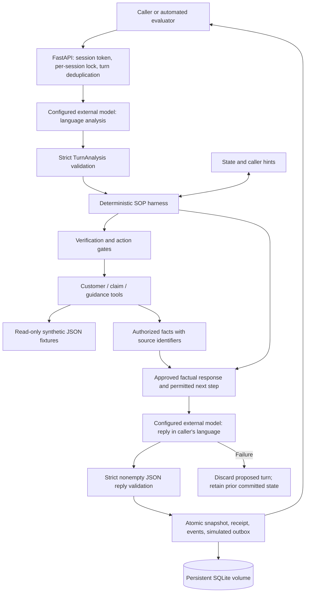
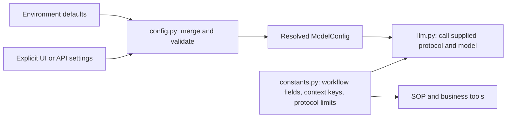
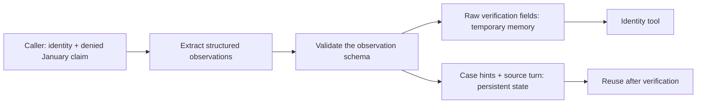
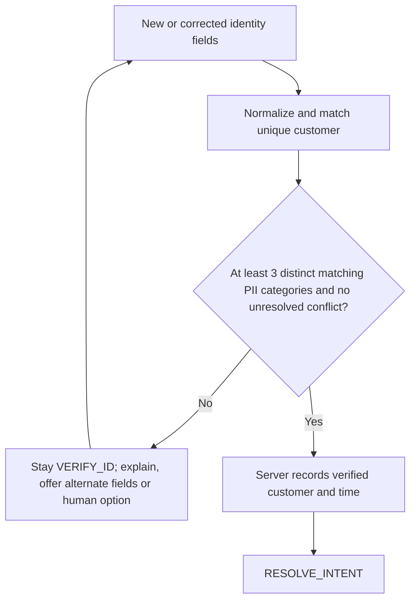
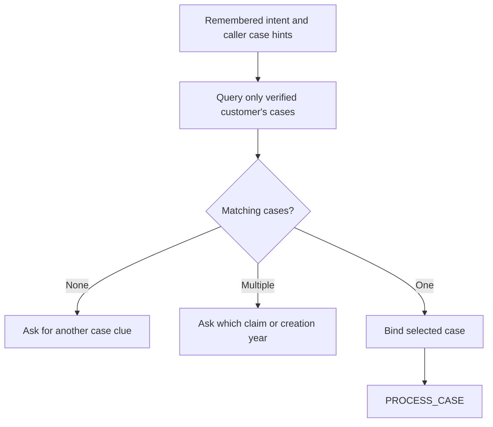
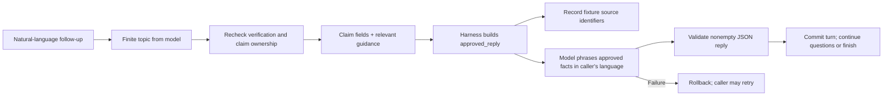
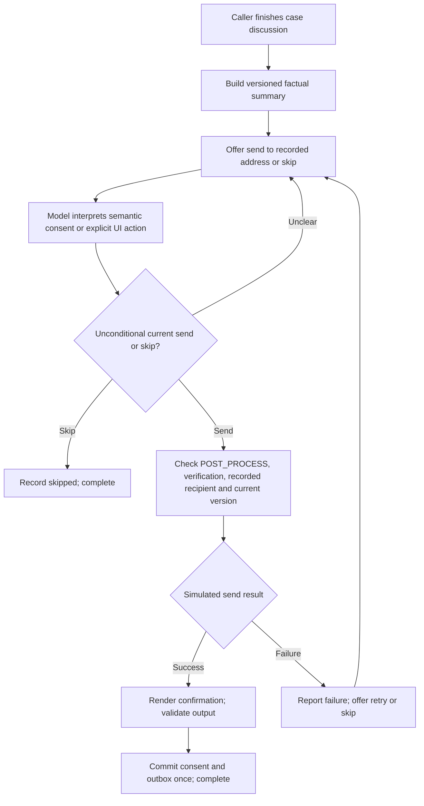
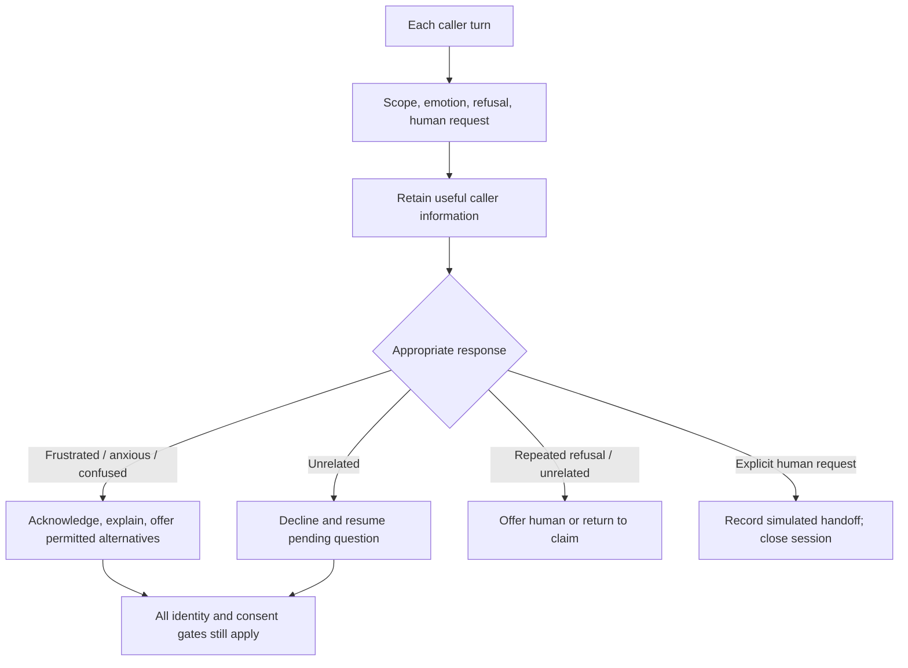
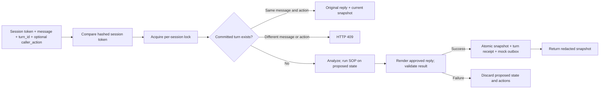
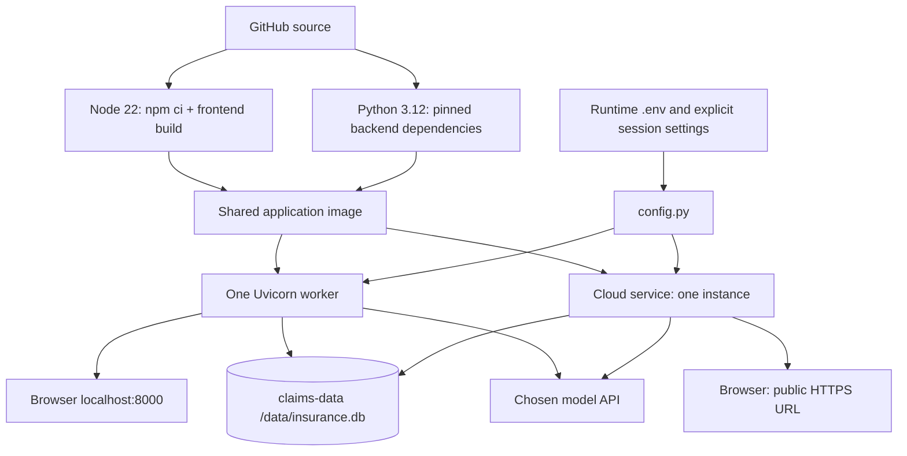

# Architecture and SOP mechanics

This implementation is a single-process application that supports local Docker and public URL deployment. The browser is a client of the same HTTP API used by automated evaluators. Each normal conversational turn follows **model analysis → deterministic SOP → model rendering**. The model produces untrusted observations and conversational wording; deterministic code controls business state and protected actions.

## Overall request path

A successful turn can pass through several stages internally, but only in the prescribed order. Queries are not executed speculatively before identity verification. A normal successful active-session turn makes two model requests: one for structured analysis, one for rendering. Invalid model output fails immediately; committed retries and terminal-session responses do not repeat those calls. No state changes or simulated sends are committed if rendering fails.

There is one business workflow for all caller languages. No English/Chinese branch selects policy behavior or consent rules. The model is instructed to match the caller's language when phrasing ongoing replies. The UI labels, static initial welcome, fixture sources, and canonical email draft remain English. Model output is constrained by an approved response plan, but structural validation alone does not prove semantic or translation accuracy.

## Configuration and shared constants

`config.py` loads environment defaults, merges explicit UI/API overrides, validates the endpoint and required fields, and returns a resolved `ModelConfig`. Omitted values inherit defaults; invalid explicit settings fail visibly. The selected protocol determines the default base URL. A different endpoint or protocol cannot borrow a deployment key.

With `HOSTED_DEMO=true`, the API requires a visitor-supplied key and ignores any server-default key. Every model configuration entry point enforces an exact endpoint allowlist from `HOSTED_MODEL_BASE_URLS`, defaulting to the official OpenAI and Anthropic API roots. Local Docker retains flexible endpoints and optional server defaults.

`constants.py` contains phase order, allowed identity fields, fixture mappings, topic mappings, permitted context keys, and Anthropic's version/output-token limit. It contains no credentials. `llm.py` does not resolve environment settings, choose model defaults, or retry through another protocol.

A session can exist before model configuration. Its top-level `model_configured` flag reflects temporary credentials in the backend; there is no `state.model_mode`. `POST /api/sessions/{id}/model` applies resolved settings. `DELETE /api/sessions/{id}/model` disconnects, after which active chat requests require configuration again.

## 1. Language understanding and cross-phase memory

Every new turn in an active session uses the configured external model through `llm.py` for analysis and response rendering. Both stages use the selected protocol:

| Protocol | Request and response |
| --- | --- |
| `openai` | `POST {base_url}/chat/completions`; Bearer key; JSON-object response format; parse `choices[0].message.content` |
| `anthropic` | Native `POST {base_url}/messages`; API key and version headers; top-level `system`, user/assistant messages, `max_tokens`; parse text content blocks |

The implementations follow the [OpenAI Chat Completions reference](https://developers.openai.com/api/reference/resources/chat) and [Anthropic Messages reference](https://platform.claude.com/docs/en/api/messages/create). Anthropic authentication/version headers are described in its [API overview](https://platform.claude.com/docs/en/api/overview).

The analysis prompt separates the extraction and SOP constraints. Pydantic permits bounded intent/topic/choice values, identity observations, verbatim `identity_evidence`, and case hints. There are no model-writable fields for `verified`, `phase`, or tool authority. Unknown fields are rejected. Invalid analysis JSON or schema output returns a model error immediately; request failures and validation errors leave business state unadvanced. There is no local language parser or provider fallback.

The analysis model receives the newest caller message plus whitelisted context: phase, pending task, hints, intent, collected identity field names, the previous assistant reply, and any `caller_action`. It does not receive the entire customer or claims database. The previous caller message is supplied separately to the renderer, where it helps preserve the conversation's language when the current input is an English-labeled UI action. Caller assertions about a case remain distinct from facts retrieved from the fixture repository. Language follows the conversation instead of a fixed `en`/`zh` state flag.

Controlled model responses are test doubles confined to automated tests. They exercise policy behavior and API request shapes without replacing the external model in the running application.

## 2. VERIFY_ID: deterministic identity gate

`FixtureRepository.verify_identity` normalizes permitted fields, resolves the same unique customer and requires at least three distinct matching categories: full name, DOB, phone, email or SSN last four. A policy number helps locate the customer but does not count toward that threshold. Registered aliases stay within their original category. Non-SSN identity types are not silently treated as SSNs.

The model extracts and normalizes identity fields. The harness accepts those structured observations and passes them to the identity repository for matching; it does not reparse caller text or cross-check quotes and date components. `identity_evidence` is used to redact original expressions, such as a written-out birthdate, before storing the transcript. Extraction accuracy therefore depends on the model; schema validation and record matching do not prove that every extracted value was stated by the caller.

Supplied conflicting fields cannot be ignored just because three other values happen to match. Identity corrections and expired verification revoke access. The protected tools also check verification and ownership at their own entry points.

Parsed raw identity values are temporary, with a one-hour inactivity expiry; the persisted transcript redacts recognized values. Verification in active sessions expires one hour after it was established. Completed sessions remain closed. These demo rules are not a substitute for a real insurer's identity-assurance process.

## 3. RESOLVE_INTENT: use remembered hints to find the case

The model interprets a caller's wording into bounded intents and case hints. The repository performs the actual filtering, scoped to the verified customer. No candidates triggers clarification; multiple candidates trigger a distinguishing question; one consistent candidate binds the selected case.

The January/healthcare/denied sample selects `CL-2048` without asking for the caller's purpose again. A January healthcare query without a status/year can be ambiguous. Creation dates are the only dates in these fixtures; service dates require clarification rather than an invented equivalence.

## 4. PROCESS_CASE: bounded topics and grounded facts

The analysis model chooses among topics such as denial, documents, alternative documents, submission method, processing time, deadline, payment, receipt and format. The repository supplies approved fixture guidance and the authorized claim record. The harness assembles an `approved_reply` containing the relevant facts, permitted recovery options, and next step. A second model request phrases that approved response naturally in the caller's language, including empathy where appropriate. The renderer has no tools or authority to advance the workflow.

Unknown topics receive a response plan explaining the limitation and a human-service option. The plan distinguishes a maximum allowable amount from guaranteed reimbursement. The business date is explicit: past appeal deadlines are marked expired and generic guidance does not override the case-specific deadline. No appeal, upload, payment or claim decision is actually changed by this demo.

Rendering accepts only a strict, nonempty JSON reply and instructs the model to treat `approved_reply` as the sole factual authority. It does not programmatically prove that the model obeyed every semantic constraint or translated every fact accurately. Automated validation therefore cannot be described as eliminating hallucinations; real-model evaluation must check wording, omissions, factual consistency, and language quality. A failed render is an unsuccessful turn, not permission to return a canned conversational fallback or commit an action without its reply.

## 5. POST_PROCESS: versioned summary and explicit choice

A caller indicating the case discussion is done causes the harness to prepare an inspectable, canonical English summary. It includes discussed topics, the recorded claim status, the outcome of this conversation and next steps. The outcome is informational support; it does not imply the insurance claim was resolved in the customer's favor. The ongoing conversational offer is rendered by the model in the caller's language.

Providing an email address alone is not consent. For typed messages, the analysis model produces a structured semantic choice; the harness does not match English or Chinese consent phrases. A conditional, future, ambiguous, or different-recipient request does not authorize a current send. The model's choice still must pass deterministic checks for the phase, identity, recorded recipient, and current summary version.

The UI's email buttons send `caller_action: "send_summary"` or `caller_action: "skip_summary"`; the case wrap-up button sends `caller_action: "finish_case"`. Each uses the ordinary message envelope. Those IDs explicitly represent a customer click and allow rendering in the prior conversational language; they are not privileged tool commands and do not bypass phase gates. Typed chat omits `caller_action`. A retried button request retains both its action and `turn_id`.

A different recipient needs a separate process and is not accepted by this demo. The summary shown in the UI masks the address. New substantive discussion updates the draft/version before a further send choice. `SIMULATE_EMAIL_FAILURE=true` exercises the failure path. Rendering must also succeed before consent, completion, and the simulated outbox entry are committed. There is no SMTP or external mail integration.

## 6. Scope, emotions and recovery

These checks apply in every phase. A mixed message can both contribute useful fields and contain an unrelated question: useful information is retained while the irrelevant question is declined. Three consecutive out-of-scope turns offer simulated human support. Refusals during verification similarly offer alternatives, then stop repeated persuasion and offer human support. Returning to in-scope conversation resumes the pending workflow.

Representative relationships are deliberately insufficient for authorization. The supplied representative and consent-scenario fixtures are not wired into a complete delegated-access flow; callers using that path are offered human support without receiving protected details.

## 7. Storage, credentials and idempotency

SQLite uses three tables: `sessions` for token hashes and snapshots, `turns` for request fingerprints and committed responses, and `email_outbox` for versioned simulated sends. A per-session async lock serializes messages within the single backend process. Snapshot, receipt and outbox writes share a transaction. The same `turn_id`, message, and optional `caller_action` return the original reply with the current snapshot, without repeating actions; changing the message or action with the same ID is rejected.

Model keys supplied by users and parsed identity values stay in process memory; recognized PII is redacted before transcript persistence. This is bounded redaction, not a guarantee for every possible sensitive statement. Session model credentials expire after one hour and are cleared at completion, handoff, disconnection or restart. A resumed active session must reconnect after those credentials are lost. Redacted snapshots remain available, and completed sessions stay closed. Server-default keys remain in deployment configuration. Do not run multiple workers without replacing in-memory coordination and secret storage with a deliberately shared design.

## 8. Deployment and evaluation

The Dockerfile first builds React with Node 22, then copies the output into a Python 3.12 application image. FastAPI serves the page and API together. The application runs as a non-root user; Compose exposes port 8000 on the host loopback address and mounts a named `/data` volume for SQLite. API keys are runtime values and excluded from the build context.

`scripts/start.py` uses the cloud's `PORT` variable, defaulting to 8000, and always starts one worker. When a platform starts the container as root for a root-owned volume, the entrypoint assigns SQLite storage to the application user and drops privileges before starting the server. Hosted instances should mount persistent storage at `/data`; free previews may use temporary storage and start new conversations after a reset.

`scripts/smoke_test.py` loads model settings through `config.py` from environment variables or the project `.env`, tests the actual provider connection, and exercises the HTTP workflow against the running app. It requires the backend dependencies and a real API token. It does not use mock model responses.

Run `backend/.venv/bin/python scripts/smoke_test.py --base-url http://127.0.0.1:8000 --multilingual` to include an additional Spanish workflow. The script prints generated replies for human review. Passing structural and SOP checks does not automatically validate the Spanish wording or translation accuracy.

Backend unit and integration tests use controlled provider responses only inside tests. They cover protocol payloads, analysis/render output validation, identity redaction, semantic-consent gates, expiry, terminal-state recovery, action-aware idempotency, and rollback on rendering failures. Controlled outputs do not prove that a real model correctly interprets multilingual statements, understands nuanced consent, or renders a faithful translation. Real-provider multilingual evaluation remains pending because no API token was supplied.

Start the container, configure protocol/key/model in **Model settings** or `.env`, test the connection, apply the settings, then chat. Remote model addresses require HTTPS; HTTP is limited to `localhost`, `127.0.0.1`, `::1`, and `host.docker.internal`.

Hosted mode serves a small public demo with visitor-owned model keys, an endpoint allowlist, uncached API responses, and a shared limit of 60 API POST requests per rolling minute. It uses the same session tokens, workflow gates, and retry receipts as local Docker. It is not a production insurance system. See [Hosting](hosting.md) for deployment, persistence, and pricing details.
